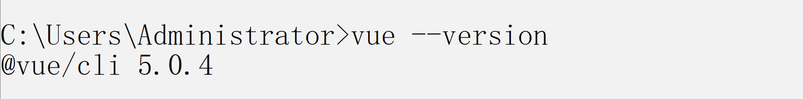
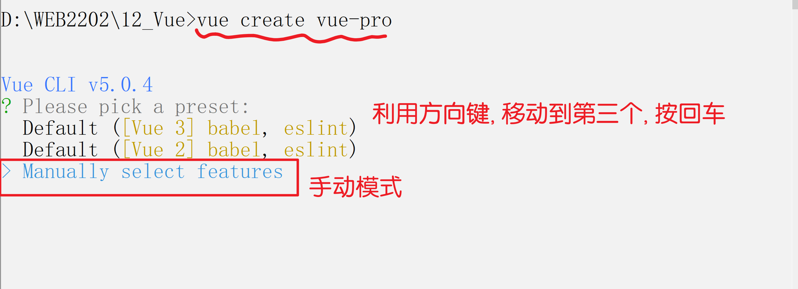
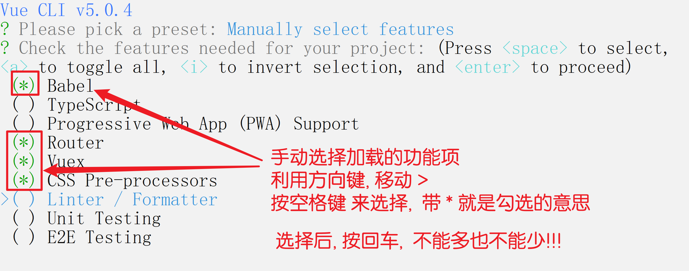
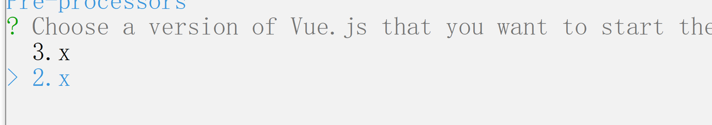
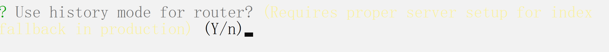
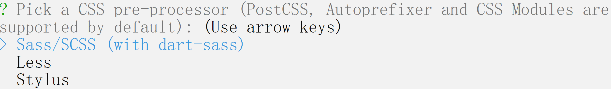
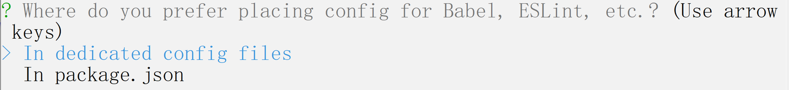
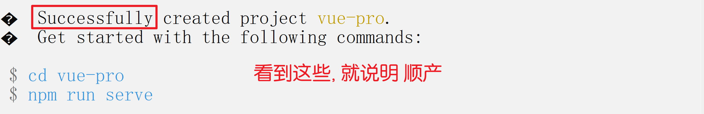

# Vue02

> Vue -- 尤雨溪
>
> https://vuejs.bootcss.com/guide/

`对比`:

- 曾经的王者: jQuery, 通过封装来简化DOM操作的代码
- 现在的顶流: Vue, 自动化思想, 让用户不用写DOM代码

`版本`:

- Vue1 -- 目前已经淘汰
- Vue2 -- 目前主流, 但是逐步在过渡到 vue3
- Vue3 -- 未来的趋势

`开发的方式`:

- 脚本方式: 适合入门阶段
- 脚手架方式: 适合实际开发

### 提前下载

https://pan.baidu.com/s/10oVRMBaEDL9uQSB1Jrrc3w
提取码: 6666

## 脚手架

> 脚手架是一类软件的总称:  用来生成完善的项目包, 类似`一键安装`
>
> 类似于:
>
> - 原始方式: 先安装电脑系统, 然后自己找软件个性化安装
> - 脚手架: 一键安装, 电脑系统 + 一套常见的软件

- 先安装脚手架软件

  - 前提: node版本在 `12 ~ 16 `   查看`node -v`

- npm需要中国镜像 -- `查看jQuery03 的文档`

- 执行全局安装命令: `npm i -g @vue/cli`

  - 安装完毕后, 通过 `vue --version` 或  `vue -V` 来查看版本号

    

- 利用脚手架来生成项目包

  > 不是一定要自己生成, 可以使用别人生成的包, 例如 百度网盘上的 `vue-pro`

  - 在你要生成项目的目录下, 执行命令: `vue create vue-pro`
    - 范式: `vue create 包名` , 即 `vue-pro` 是自定义的包名, 可以随便起
    - 

  - 个性化选项

    

  - 选择 vue2 版本

    

  - 直接回车

    

  - 直接回车

    

  - 直接回车

    

  - 直接回车

    

  - 成功

    

  - 如果安装了 Git 软件, 可能会有额外的提示, 不用管
  - 如果生错了, 则到文件夹里 删除掉, 然后重新生
  - 无法自己生成, 用百度网盘提供的包 或者 跟其他能生的同学要 都可以!

